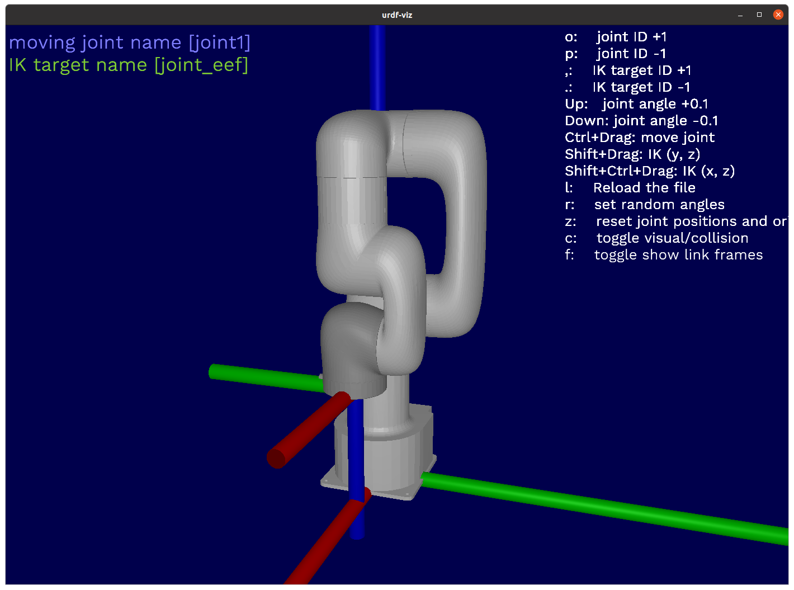

# OpenRR Apps UFACTORY Lite 6



## Installation

### Install `ROS` package

Please enable `ROS`

```bash
mkdir -p ~/xarm_ws/src
cd ~/xarm_ws/src
git clone https://github.com/xArm-Developer/xarm_ros
cd xarm-ros
git pull
git submodule sync
git submodule update --init --remote
cd ~/xarm_ws
catkin_make
```

#### See also

- [xarm_ros](https://github.com/xArm-Developer/xarm_ros)
- [xarm_ros2](https://github.com/xArm-Developer/xarm_ros2)

### Install `urdf-viz`

```bash
cargo install urdf-viz
```

### Install `openrr-apps`

```bash
cargo install --git https://github.com/openrr/openrr.git
```

### Setup URDF file

Clone this repository.

```bash
git clone https://github.com/openrr/openrr-apps-ufactory-lite6
cd openrr-apps-ufactory-lite6
```

Then create urdf file for `openrr-apps`.

```bash
xacro ~/xarm_ws/src/xarm_ros/xarm_description/urdf/lite6_robot.urdf.xacro > lite6_robot.urdf
```

## urdf-viz

Simulate on `urdf-viz`.

### openrr_apps_joint_position_sender

```bash
urdf-viz lite6_robot.urdf &
```

```bash
openrr_apps_joint_position_sender --config-path ./config/robot_client_config_for_urdf_viz.toml
```

### openrr_apps_robot_teleop

```bash
urdf-viz lite6_robot.urdf &
```

```bash
openrr_apps_robot_teleop --config-path ./config/teleop_config_for_urdf_viz.toml
```

## ROS

Run a real robot in `ROS`.

```bash
roslaunch lite6_moveit_config realMove_exec.launch robot_ip:=192.168.1.xxx
```

```bash
openrr_apps_robot_teleop --config-path ./config/teleop_config_for_ros.toml
```
